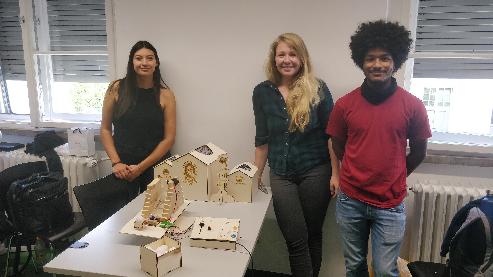

# Sketching with Hardware

## LMU Group Project
Build a fun game called Wiesn-Schmeißer with two Arduinos.

Format: 

Format: 

https://youtu.be/K45SGXjvSLg - automatic!
[Youtube](https://youtu.be/K45SGXjvSLg)